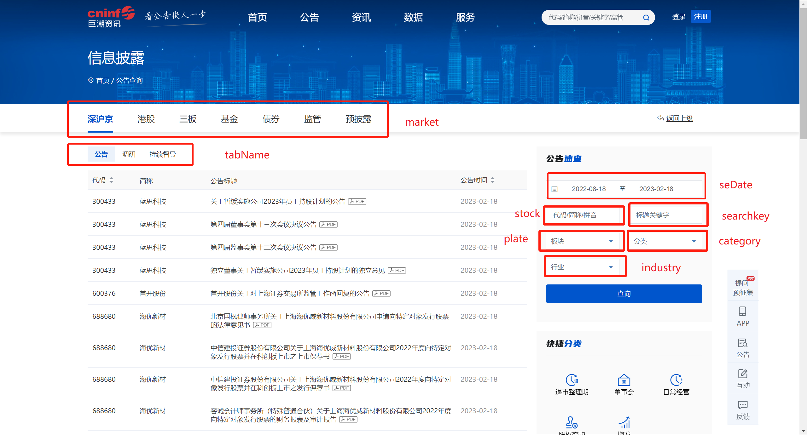

# cninfo-reports-cli

一个用于查询和下载 [巨潮资讯网](http://www.cninfo.com.cn/) 公告的 Rust CLI。

它适合做几类事情：

- 按股票代码查询公告元数据
- 下载公告 PDF
- 默认抓取当年截至今天的数据
- 一键抓取 A 股全市场定期财报



## 安装与构建

```powershell
cargo build --release
```

构建后的可执行文件在：

```text
target/release/cninfo-reports-cli.exe
```

开发时也可以直接用：

```powershell
cargo run -- <命令>
```

## 快速开始

更新本地股票代码缓存：

```powershell
cargo run -- update-stocks
```

查询单只股票今年以来的公告：

```powershell
cargo run -- query `
  --market szse `
  --stock 000001 `
  --output-json output/000001-announcements.json
```

查询并下载单只股票今年以来的 PDF：

```powershell
cargo run -- query `
  --market szse `
  --stock 000001 `
  --download `
  --output-dir output/pdfs
```

抓取 A 股全市场今年以来的定期财报：

```powershell
cargo run -- query `
  --market szse `
  --all-stocks `
  --reports `
  --output-json output/a-share-reports.json `
  --download `
  --output-dir output/a-share-reports-pdf
```

如果已经保存了公告 JSON，也可以不重新查询，直接从 JSON 下载 PDF：

```powershell
cargo run -- download-json output/a-share-reports.json `
  --output-dir output/a-share-reports-pdf `
  --max-concurrent 8
```

## 默认时间范围

`query` 默认使用“当前年份截至今天”的范围。

例如在 `2026-07-02` 运行时，默认日期范围是：

```text
2026-01-01~2026-07-02
```

如果要指定时间范围，使用 `--date-range`：

```powershell
cargo run -- query `
  --stock 000001 `
  --date-range 2025-01-01~2025-12-31
```

## 输出位置

默认情况下：

- 公告元数据 JSON 打印到 stdout
- 只有传入 `--download` 才会下载 PDF
- PDF 默认下载到当前工作目录下的 `data/`
- 股票代码缓存默认读取当前工作目录下的 `stocks.json`

建议总是显式指定输出位置：

```powershell
cargo run -- query `
  --stock 000001 `
  --output-json output/000001.json `
  --download `
  --output-dir output/000001-pdf
```

运行时 CLI 会在 stderr 打印本次任务的关键落点，例如：

```text
date range: 2026-01-01~2026-07-02
announcement JSON: output/000001.json
PDF output directory: output/000001-pdf
```

## 常用参数

| 参数 | 说明 |
|---|---|
| `--market szse` | A 股、深沪京公告 |
| `--market hke` | 港股公告 |
| `--stock 000001` | 指定股票代码，可重复传入 |
| `--all-stocks` | 查询整个市场，不限定股票代码 |
| `--reports` | 使用 A 股定期财报分类预设 |
| `--category <分类>` | 手动指定公告分类，可重复传入 |
| `--date-range <范围>` | 指定日期范围，格式为 `YYYY-MM-DD~YYYY-MM-DD` |
| `--output-json <路径>` | 保存公告元数据 JSON |
| `--download` | 下载公告 PDF |
| `--output-dir <目录>` | 指定 PDF 下载目录 |
| `--max-concurrent <数量>` | PDF 并发下载数，默认 `5` |

## 大盘抓取建议

全市场财报在 3-4 月会非常密集，巨潮接口容易对大日期范围返回 504。
`--all-stocks` 模式会自动按周查询；如果某个周仍然过大，会继续拆成更小日期范围并自动去重。

推荐先保存元数据，再从 JSON 下载 PDF：

```powershell
cargo run -- query `
  --market szse `
  --all-stocks `
  --reports `
  --output-json crawl-output/a-share-reports-2026-ytd.json

cargo run -- download-json crawl-output/a-share-reports-2026-ytd.json `
  --output-dir data-a-share-reports-2026-ytd `
  --max-concurrent 8
```

## 财报分类预设

`--reports` 当前等价于以下 A 股定期报告分类：

| 分类代码 | 含义 |
|---|---|
| `category_ndbg_szsh` | 年度报告 |
| `category_bndbg_szsh` | 半年度报告 |
| `category_yjdbg_szsh` | 一季度报告 |
| `category_sjdbg_szsh` | 三季度报告 |

如果要更细地控制公告分类，可以不用 `--reports`，改成手动重复传
`--category`。

## 市场代码

| market | 含义 |
|---|---|
| `szse` | A 股，深沪京公告 |
| `hke` | 港股公告 |
| `third` | 股转系统公告 |
| `fund` | 基金公告 |
| `bond` | 债券公告 |

## 迁移说明

原 Python 实现仍保留在 [CnInfoReports.py](CnInfoReports.py)，方便对照迁移逻辑。

## 鸣谢

[xfeng2020/cninf_reports](https://github.com/xfeng2020/cninf_reports)
